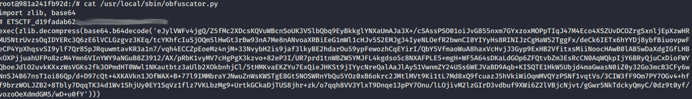
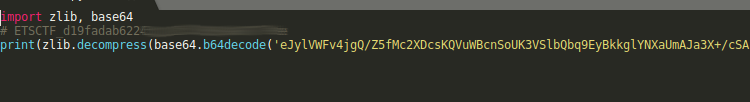
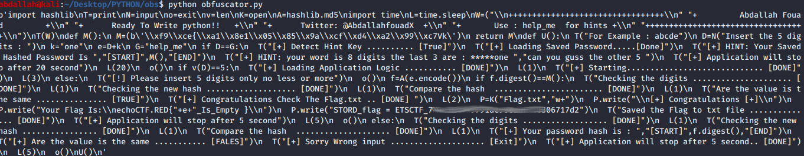
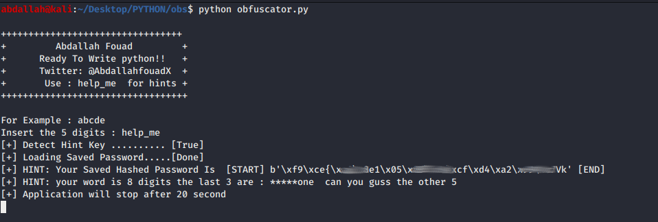
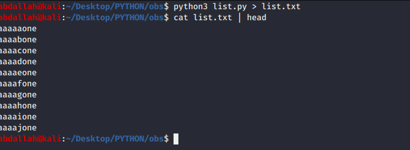

# The Constrictor Obfuscator
* **Author**: _Abdallah Fouad / OverRidex0 / @AbdallafouadX_
* **Editing**: _Pantelis Roditis / databus / @PantelisRoditis_
* **Category**: _Reverse Engineering, Code Analysis, Crypto_
* **Difficulty**: _medium_
* **Points**: _1,500_

> This challenge will test your patience as well as your ability to de-obfuscate, read and understand what the Python code does.
>
> In order to check the challenge you will need docker installed on your system.
>
> Start the challenge by running `docker run -it echothrust/the_obfuscator_101:v0.2` and take it from there.
>
> Alternatively you can run with `docker run -it echothrust/the_obfuscator_101:v0.2 bash` and then from withing the container run `python3 /usr/local/sbin/obfuscator.py`

So as we can see this challenge is running from docker, so we need to start the docker daemon, if not currently running, pull the image and run it.

```sh
$ sudo service docker start
$ docker pull echothrust/the_obfuscator_101:v0.2
$ docker run -it echothrust/the_obfuscator_101:v0.2 bash
```
## Q1: What is the source code flag? (100 pts)
> There is a flag in the source code of this file, find it and provide it as an answer here (format ETSCTF_xxxxxxxx).

Once started we start by taking a look at the source code.
```sh
cat /usr/local/sbin/obfuscator.py
```



We can see the first flag on the second line of the file.

## Q2: What is the flag of the obfuscated source code (200 pts)
> There is a flag in the obfuscated source code, see if you can find what it is and provide as an answer here (format ETSCTF_xxxxxxxx).

In order to find the second flag we will have to see what the actual code looks like, so instead simply replace the `exec` call with a `print` one.



Run the modified script and check its output



Looking carefully we can see the source code as well as the second flag `STORD_flag=ETSCTF_abcdefg012345678901234567890abcdefg`.

## Q3: What is the hashed password for the application (300 pts)
> Find and provide the hashed password for the application as an answer here.

Running the script and giving a random input (in our case `aaaaaa`) we see the following


The script provides a `help_me` option so lets give it and see what we get



The password hash is right there
```
[+] HINT: Your Saved Hashed Password Is  [START] b'\x9f\xec{\x1a\x9e1\x15\x45\x4a\xff\xdd\xae\x91\xc7Vk' [END]
```

Give this hash as an answer without the `b''` parts, like so `\x9f\xec{\x1a\x9e1\x15\x45\x4a\xff\xdd\xae\x91\xc7Vk`.

## Q4: What is the password required by the application (400 pts)
> The application requires a five character password, find it and provide it as an answer here.

In order to answer the 4th question we will have to perform some brute forcing,
since the password hash doesn't seem to be based on any reversible algorithm.

We need to create a list of all possible combinations of words with 5 letters. A quick python script can help us with that

```python
chrs = 'abcdefghijklmnopqrstuvwxyz'
n = 5
y = "one"   #← For the lenght password
for xs in itertools.product(chrs, repeat=n):
    print (''.join(xs)+str(y))
```

We run the script and save the word list in a file to be used later



Now that we have our list, we need to iterate all our passwords and see which one is correct.

For this we put together another tiny script that will go through all our generated words, but first we have grab the hash value from the original script to compare against.

```python
import hashlib, sys

def hashed_password():
    hashed_password = b'\x9f\xec{\x1a\x9e1\x15\x45\x4a\xff\xdd\xae\x91\xc7Vk'
    return hashed_password

def y():
    ff = open('list.txt', 'r')
    passwords = ff.readlines()
    for password in passwords:
        full_password = hashlib.md5(password.strip().encode()).digest()
        if full_password == hashed_password():
            print("[+] Congratulations Check The Flag.txt .. [DONE] ")
            R=open("Flag.txt","w+")
            R.write("\n[+] Congratulations [+]\n")
            R.write("Your Flag Is:echoCTF.RED{"+str(password)+"_Is_Empty }\n")
            R.close()
            exit("[!] Done password Found :" + str(password))
        else:
            print("[!] Not Found password value :----->" +password)

y()
```

We run the script and after a while we will see the magical message
```
[+] Congratulations Check The Flag.txt .. [DONE]
[!] Done password found: abcdefone
```

The answer to the question is the password without the `one` at the end, `abcdef`.


## Q5: What is the flag the application gives when you provide the correct password (500 pts)
> When you enter a correct password the application will create a file with the final flag. Find the file and provide the flag as an answer (format echoCTF.RED{flag}).

And with that we reached the answer to the last question. Simply list the contents of `Flag.txt` (duh!)
```sh
$ cat Flag.txt
[+] Congratulations [+]
Your Flag Is:echoCTF.RED{abcdefone_Is_Empty }
```
